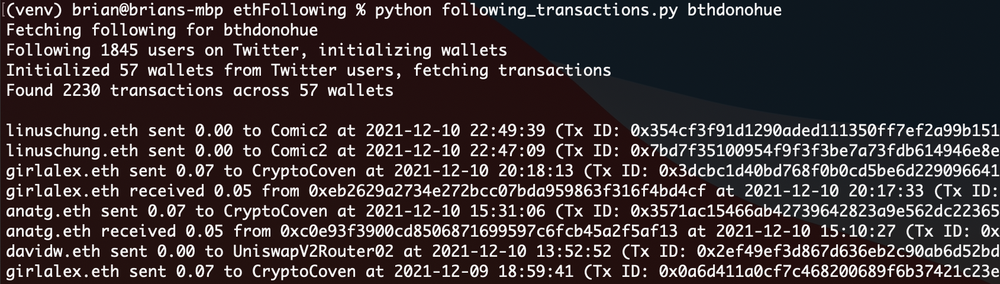

# ethFollowing

Ethereum transactions and wallet information for people you follow on Twitter.



## Set up


1. Setup python environment (requires python 3.8):

```
virtualenv venv
source venv/bin/activate
pip install -r requirements.txt
```

2. Create a Twitter APIv2 Project in the [Twitter Developer Portal](https://developer.twitter.com/en/portal/dashboard), navigate to *Keys and Tokens* in the project, and set the bearer token as an environment variable:

```
export TWITTER_BEARER_TOKEN=<your-bearer-token>
```

3. Create an [Infura project](https://infura.io) and set the Project ID as an environment variable:

```
export WEB3_INFURA_PROJECT_ID=<your-infura-project-id>
```

4. Create an [Etherscan](https://etherscan.io/myapikey) API Key, and set it as an environment variable:

```
export ETHERSCAN_API_TOKEN=<etherscan-api-token>
```

Etherscan API key is required to use `following_transactions.py`, but not `following_wallets.py`.

## Running the scripts

Both the scripts take a Twitter username as a parameter, fetch the "following users" for that username, and then performs its function (either pull transactions, or show wallet information):

```
python following_transactions.py <twitter-username>
python following_wallets.py <twitter-username>
```

## How it Works

* Twitter API is used to get a list of following users given a Twitter username. Both scripts look for ENS `.eth` addresses in the user's display name and location.
* Infura acts as an Ethereum node provider. There are [other options](https://web3py.readthedocs.io/en/stable/providers.html), including running your own Ethereum node locally. The Ethereum node provider resolves ENS addresses, and provides balances for wallet addresses.
* Etherscan is used to fetch a list of transactions. Ethereum nodes allow you to traverse transactions over some range (including the whole range), but cannot be used to make queries against the blockchain. Etherscan API allows us to query transactions by address, which is used by `following_transactions.py`

## Copyright

Copyright &copy; Brian Donohue

Permission is hereby granted, free of charge, to any person obtaining a copy of this software and associated documentation files (the "Software"), to deal in the Software without restriction, including without limitation the rights to use, copy, modify, merge, publish, distribute, sublicense, and/or sell copies of the Software, and to permit persons to whom the Software is furnished to do so, subject to the following conditions:

The above copyright notice and this permission notice shall be included in all copies or substantial portions of the Software.

THE SOFTWARE IS PROVIDED "AS IS", WITHOUT WARRANTY OF ANY KIND, EXPRESS OR IMPLIED, INCLUDING BUT NOT LIMITED TO THE WARRANTIES OF MERCHANTABILITY, FITNESS FOR A PARTICULAR PURPOSE AND NONINFRINGEMENT. IN NO EVENT SHALL THE AUTHORS OR COPYRIGHT HOLDERS BE LIABLE FOR ANY CLAIM, DAMAGES OR OTHER LIABILITY, WHETHER IN AN ACTION OF CONTRACT, TORT OR OTHERWISE, ARISING FROM, OUT OF OR IN CONNECTION WITH THE SOFTWARE OR THE USE OR OTHER DEALINGS IN THE SOFTWARE.
